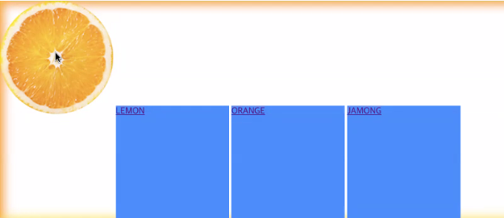
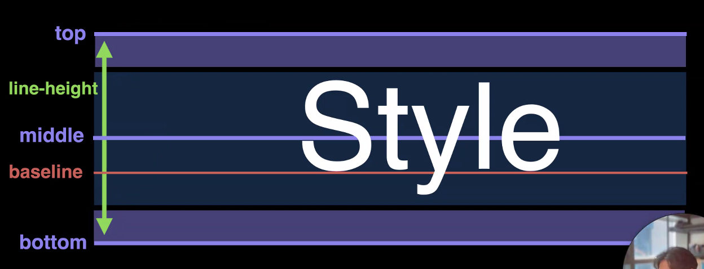

# 과제

## 1. 픽셀퍼펙션

- 제공된 디자인과 차이 없이 만들기

- 제일 중요한데 놓치기 쉬운 것

- 여백, 폰트사이즈 등 발견하는 능력 필요

## 2. 컨텐츠 이미지, 배경 이미지 구분

컨텐츠라고 볼 수 없는 이미지는 기본적으로 마크업하지 않는다.

(컨텐츠의 풀 이미지는 컨텐츠와 상관 없으므로 `background-image`로 넣는다.)

> 가상요소를 사용하여 마크업하지 않고 css만으로 배경을 추가할 수 있다.

## 3. 전역 스타일 상속

```css
:root {
  font-family: "arial";
}
```

`html`을 의미하는 가상 선택자 `:root`로 하위 모든 요소들이 디자인에 영향을 받도도록 한다.

`font-family`를 먼저 적용하는 이유는 폰트가 바뀌면 외곽의 여백도 변하는 경우가 있기 때문이다.

## 4. 클래스 작명

`.wrapper`는 레이아웃(식판 역할)로 하위에는 컴포넌트 요소들(`.animal`)을 가지고 있다.

- 내가 원하는 것을 선택할 수 있어야 한다.

- 식별이 쉬워야한다 (확장성 고려)

## 5. Semantic Markup

- `main`은 주요 컨텐츠로 전체 페이지에 한 번 사용하는 것이 추천된다.

- `section`, `article`는 `main`과 다르게 상하위 관계로 자유롭게 마크업할 수 있다.

- 마크업에서의 `header`는 의미적(머릿말)으로 사용되어야 한다.

## 6. 접근성

UX와 관련된 용어로 사용자가 쉽게 이용할 수 있게 하는 정도와 관련되어 있다.

예를 들어 img에 alt 속성을 주어 시각 장애인들을 위한 접근성을 높일 수 있다.

## 7. 유지보수성

컨텐츠 내용, 레이아웃의 변화에 대응하는 코드 작성

- height 고정하지 않기

- 메인 이미지 가운데 정렬

- 풀 배경 repeat-x로 가로 확장성

# 마크업

## 1. header 마크업

```html
<header class="header">
  <a class="logo" href=""></a>
  <nav>
    <ul>
      <li><a href=""></a></li>
      <li><a href=""></a></li>
      <li><a href=""></a></li>
      <li><a href=""></a></li>
    </ul>
  </nav>
</header>
```

# 인라인 요소의 특징

## 1. 세로 간 여백

인라인 요소는 줄바꿈문자(엔터)를 만나면 다음 요소와 구별을 위해 한 칸 띄어써진다.

## 2. 사이즈

```css
span {
  width: 200px;
  height: 200px;
}
```

위 스타일은 인라인 요소에 적용되지 않는다. 컨텐츠가 요소 밖으로 넘어가면 자동으로 줄 바꿈되기 때문이다. 대신 `padding`을 사용한다.

## 3. 마진

인라인 요소는 상하단 마진을 가지지 못한다. 마진을 가지게 되면 baseline이 깨지기 때문이다.

## 4. 패딩

상하단 패딩은 가질 수 있지만 페이지 상에서 공간을 차지하지는 못한다.

> 한 줄에 표시되는 인라인 요소의 특징을 가지면서 공간까지 차지하게 하기 위해 `display: inline-block`을 사용할 수있다.

## 5. vertical align

한 줄에 있는 인라인 요소간의 세로 정렬

초기값은 `baseline`이다.

만약 요소에 내용이 없는 경우(img) 해당 요소의 bottom이 다른 요소의 baseline에 맞춰 표시된다.



## 6. lign height

인라인 요소에서 한 줄의 높이를 의미한다.

기본값은 `normal`로 폰트에 따라 다른 배수의 값을 가지며 줄의 높이를 폰트사이즈 x 배수로 계산한다.

`line-height`의 값과 인라인-블록 요소의 높이를 같게 하면 세로로 가운데 정렬된다.

> 폰트사이즈 위 아래로 **half-leading area**가 붙어 `line-height`를 형성한다.



# CSS

## 1. 로고 작성

inline-block의 첫번째 a요소에 background-image를 주어 로고를 만들되, 내용도 함께 유지하여 접근성을 높인다.

IR기법을 이용해 내용이 표시되지 않게 할 수 있다.

```css
.ir {
  position: absolute;
  clip: rect(0 0 0 0);
  width: 1px;
  height: 1px;
  margin: -1px;
  overflow: hidden;
}
```

또는 text-indent를 설정한다.

```css
a {
  text-indent: -9999;
}
```
