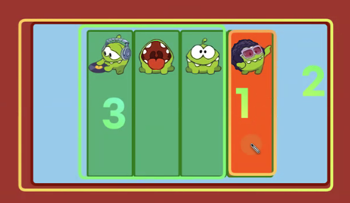
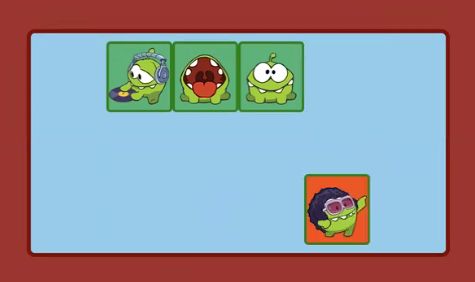
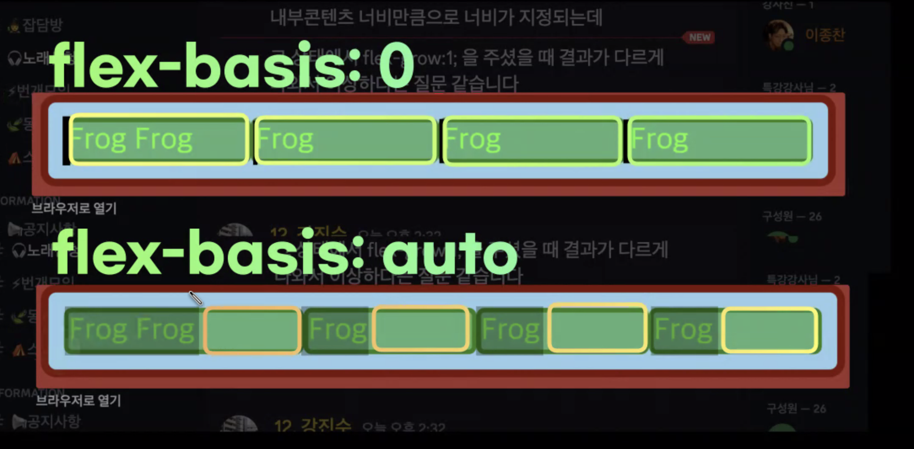

# Flex

## 1. 가용공간

**flexbox**에도 마찬가지로 **가용공간**의 개념이 적용된다.

**flexitem**들은 **flexbox**안에서 컨텐츠의 크기만큼 붙게되고, 나머지를 **가용공간**으로 갖게된다.

이 때 마지막 **flexitem**에게 **margin-left: auto**를 주면 해당 개구리가 가용공간을 왼쪽 마진으로 계산하여 사용한다.


> 모든 flexitem들이 같은 가용공간을 **공유**하고있음이 중요하다. (따라서 가운데 개구리에게 margin: 0 auto를 주면 space-between과 같은 상태가 된다.)

## 2. justify-contents

만약 flexitem들이 flexbox를 초과하면 overflow된다.


이 때 flexbox에 justify-content: flex-end를 ain axis를 기준으로 왼쪽 끝으로 정렬이 바뀌게 된다. (justify-content의 초기값은 flex-start)

> flexbox에 justify-conetnt: center와 flexitem에 margin: 0 auto를 적용하면 margin이 우선 적용된다.

실험 필요

## 3. align-items

flexbox는 `align-items`에 normal(stretch)의 초기값을 가지고 있다. 부모의 높이가 늘어나면 flexitem들도 같이 늘어난다.



세로에도 가용공간이 있으므로 `margin`을 이용해 flexitem 위치도 함께 이동시킬 수 있다.



`align-items: flex-start` 후 마지막 개구리에게 `margin-top: auto`

> flex는 가로뿐만아니라 세로까지 가용공간을 만들어준다.

> flexbox의 `justify-contents`와 `align-items`는 flexitem에 margin값이 있다면 덮어씌워진다.

## 4. flex-wrap

flexbox은 `no-wrap`을 초기값으로 가지는 `flex-wrap` 속성을 가지고 있다.

`flex-wrap: wrap`을 주면 overflow된 flexitem을 다음줄에 배치하고, 각 flexitem들은 해당 행의 가용공간을 공유한다.

# 레아아웃 디자인

## 1. 반응형 너비

```css
.l_wrapper {
  max-width: 1200px;
  width: auto;

  margin: 0 auto;
}
```

최대 너비가 `1200px` 이하의 반응형 `wrapper`

## 2. 마크업

### Flex

`wapper` 아래에 flexbox 설정을 위한 `div`가 하나 더 필요하다. (`wrapper`에 `flex` 주면 안 된다.)

### 가상요소

가상요소는 시작과 끝을 가진 컨테이너 요소에 더해질 수 있다. `img`는 그런 특성이 없는 대체요소이므로 가상요소를 가질 수 없다.

### Flex item

Flexitem은 `display`의 값에 상관없이 flexitem만의 성질을 갖는다. (`justify-contents: flex-start`, `align-items: stretch`)

# Flex 2

## 1. flex-basis

flexitem의 속성 `flex-basis`은 초기값이 `auto`이고 `flex-basis: auto`는 내부 컨텐츠만큼 flexitem의 너비를 정한다.

> 단 `min-width`의 초기값이 `auto`, **flex item에서는** 내부 컨텐츠의 길이기 떄문에 그보다 작은 값으로 `flex-basis`를 주면 flexitem의 너비가 변하지 못한다.

## 2. flex-grow

flexitem의 속성이며 초기값이 0이다.

3개의 flexitem의 flex-grow값이 1, 1, 2인 경우

1. 가용공간을 1:1:2로 나눈다.

2. 각 flexitem의 flex-basis에 나눈 가용공간을 더한다.

> `flex-grow`값이 크다고 너비가 가장 넓은 flexitem이 아니다. 나누어진 가용공간은 `flex-basis`에 더해지기 때문이다.

> `flex-basis`가 0 또는 고정된 px값이면 `flex-grow`의 비율만큼 flexitem의 크기가 결정된다.



## 3. flex-shrink

만약 flexitem이 줄어들 수 있는 **flex-basis로 생성된 컨텐츠 외부 너비(basis)**를 충분히 가지고 있는 상태에서 flexitem이 추가될 때

각 flexitem basis가 일정하게 줄어든 후 flexbox 내부에 새로운 flexitem이 추가된다.

이 때 basis가 줄어드는 비율이 flex-shrink로, 초기값은 1이다.

- 가용공간이 flexitem들의 basis 합보다 작을 때

  

  모든 flexitem들의 basis가 줄어든 후 새로운 flexitem이 overflow 된다.

- 마지막 flexitem에 flex-shrink: 0을 주었을 때

  

  해당 flexitem의 basis가 줄어들지 않는다.

- 첫째 flexitem에 1보다 큰 flex-shrink값을 주었을 때

  

  해당 flexitem이 가장 큰 비율로 basis가 줄어든다.

# 레이아웃 디자인

1. 컨테이너에 `display: flex`를 준다.

2. 컨테이너에 `min-height`를 준다. (컨텐츠가 늘어날 경우를 대비)

3. 메인 아이템에 `flex-grow: 1`을 준다.  
   : 가용 공간을 basis에 더한다.

4. 사이드바 아이템에 `flex-basis: 168px`을 준다.

5. 가변 높이 설정을 위해 컨테이너에 `align-items: flex-start`를 준다.


