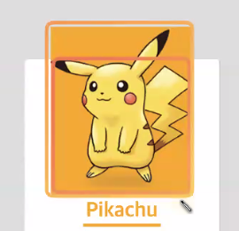
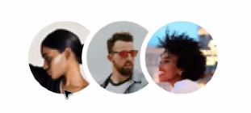
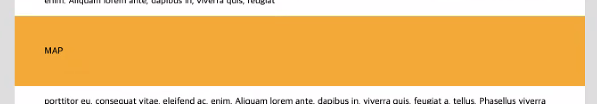
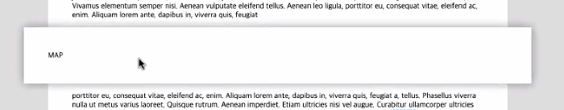
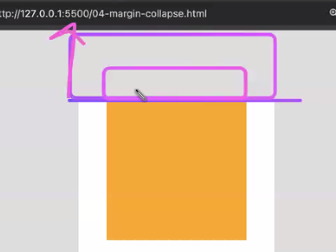

주제: 네거티브 마진, 가상 요소, 마진 병합, 미디어 쿼리

# 과제 리뷰

## 1. 네거티브 마진

마진: 실제 요소가 **차지하고 있는 공간**과 **보여지는 영역**을 별도로 관리할수있게 만들어주는 속성

차지하고 있는 공간: 피카츄 뒤의 가상 공간 (여백)

보여지는 영역: 피카츄 이미지와 같이 크기가 변하지 않는 시각적인 부분

**margin-top: -50px**



보여지는 영역은 그대로이고, 차지하는 공간 중 윗 부분이 -50px 줄어들었다.

만약 `margin-bottom: -50px`을 주면 Pikachu 글씨가 그림 위로 올라오게 되는데, 이것은 `img` 아래에 `h1`이 작성되었기 때문이다.

**margin-top: -200px**


차지하고 있는 공간이 줄어듦에 따라 상위 요소 (컨테이너)의 높이도 함께 줄어든 것을 확인할 수 있다.

**네거티브 마진의 활용**



## 2. width: auto와 width: 100%의 차이

### auto

박스모델(패딩, 보더, 마진)을 고려하여 컨테이닝 블록(부모 요소가 제공하는 너비)을 가득 채운다.

### 100%

박스모델을 고려하지 않고 컨테이닝 블록을 채우기 때문에 요소에 패딩이 있는 경우 오른쪽으로 삐져나온다.

### 활용

**요소가 부모의 패딩을 덮게 만들기**

```css
width: auto;
padding: 50px;
margin-left: -50px;
margin-right: -50px;
```



차지하는 공간(margin)이 좌우 50px 줄어든 상태에서 요소의 박스레벨(padding)을 고려해 부모의 컨테이닝 영역을 채운다.

**transition, box-shadow를 이용하면 더 재밌는 효과를 줄 수 있다.**



# 타임라인 디자인

## 1. width 50%을 유지한 채 패딩을 더하기

1. 아이템에 box-sizing: border-box

2. calc를 이용해 padding만큼 width에서 뺄셈

3. 아이템에 width: auto, margin-left: 50%

4. **마크업 추가, 하위 요소에 width: auto와 padding 준다. (추가 스타일링에 용이하기 때문에 추천)**

---

한 분야 (CSS)에만 매몰되어 해결 방법을 찾지 말자.

웹은 HTML, CSS, Javascript가 연결되어 동작하기 때문에

유연한 사고에서 신박한 해결 방법이 나올 수 있다.

## 2. 레이아웃 구성

1. width(%), padding, negative margin 사용하여 가운데 빈 공간 주고 지그재그 모양의 레이아웃 구성

2. `max-width`로 화면 너비가 커졌을 때 최대 너비 제한

## 3. 미디어 쿼리

1. max-width: 960px의 뷰포트에서 헤더 스타일과 아이템의 `width`, `margin` 수정하여 세로로 보여지도록 만든다.

> 미디어 쿼리 안에서 속성의 값을 변경할 때 셀렉터 특정성 점수를 유지해야 스타일링이 반영된다.

# 마진 병합

## 1. 조건

블록 레벨 요소 끼리의 상하단 마진이 병합된다.

형제끼리의 마진 병합은 자연스럽지만 부모와 자식 요소 간의 마진 병합은 수정할 필요가 있다.

**body, wrapper, box 세 개의 블럭 요소가 box의 마진만 공유하고 있는 경우**d



## 2. 해결 방법

**형제끼리의 마진 병합**

- box 또는 wrapper의 display를 inline-block으로 바꾼다.

**부모와 자식간의 마진 병합**

- 부모에 border, padding과 같은 경계를 주면 부모와 자식의 마진이 분리된다.

- 부모에 overflow의 값에 visible이 아닌 값을 준다.

  : overflow는 새로운 문서의 시작점으로 재구성되기 떄문에 경계가 생기기 때문이다.

  : `overflow: hidden` 때문에 box-shadow가 잘리는 등의 문제가 발생한다.

- 부모에 `display: flow-root`를 준다.

  : overflow 값을 주는 것과 마찬가지로 부모를 새로운 블록 포맷팅 컨텍스트 (BFC)로 바꾼다.

  : 추천 방법

# 가상 요소

마크업을 하지 않고도 시각적인 요소를 추가하는 방법

```css
.pokemon h1::before {
  content: " ";
  display: block;
  width: 40px;
  height: 4px;
  margin: 0 auto;
}
```

content 속성에 빈 값을 준 후 `display: block`을 준다.

생성된 요소를 CSS만으로 디자인한다.

> `ol`은 `li`를 하위요소로 가지고, `h1`은 `div`를 하위요소로 가질 수 없기 때문에 가상요소를 추가하면 마크업 없이 디자인 요소를 추가할 수 있다.
