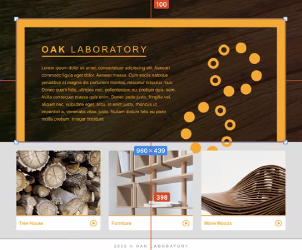
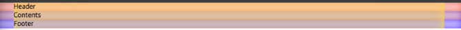
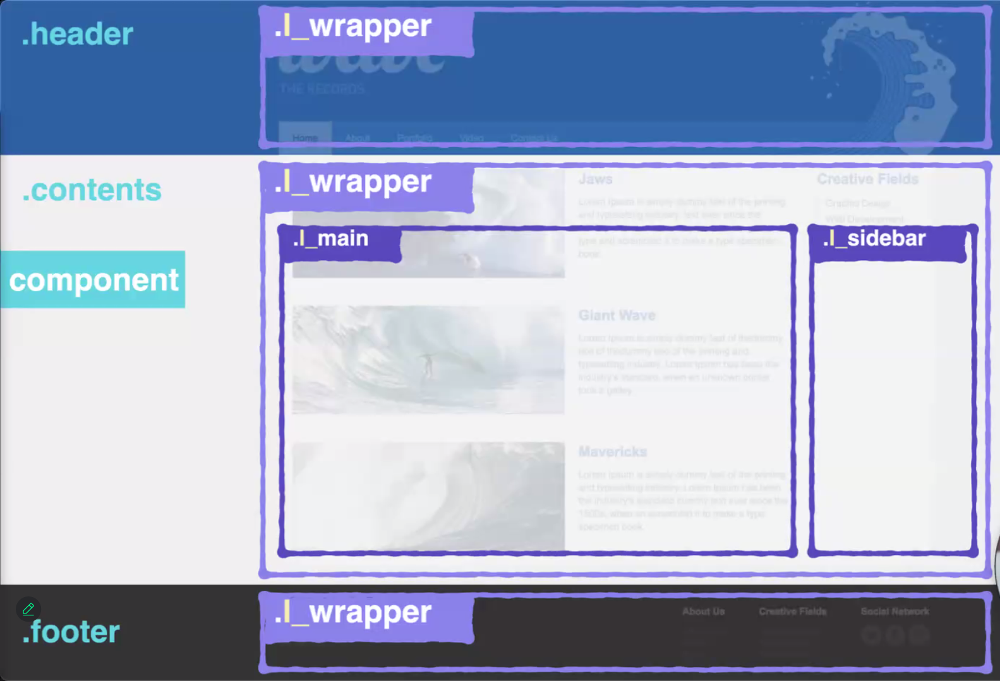
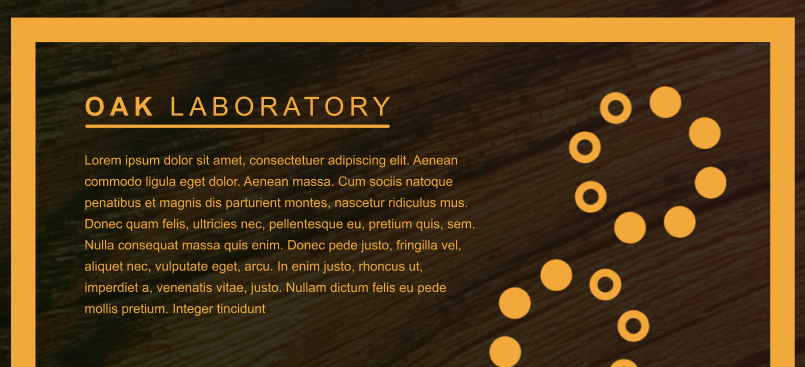

# 과제 리뷰

## 1. 레이아웃

페이지에 공통적으로 보이는 레이아웃을 공통분모 l_wrapper를 사용하여 스타일링한다.

```html
<body>
  <header><div class="l_wrapper"></div></header>
  <main><div class="l_wrapper"></div></main>
  <footer><div class="l_wrapper"></div></footer>
</body>
```

```css
.l_wrapper {
  width: 960px;
  margin: 0 auto;
}
```





이를 통해 다음의 효과를 얻을 수 있다.

1. 페이지 구역에 동일한 레이아웃(`l_wrapper`)를 적용할 수 있다.

2. 레이아웃을 유지한 채 `header`, `main`, `footer`에 각각 다른 `background-image`를 적용할 수 있다.

> 레이아웃 클래스(`l_wrapper`)에는 관련 속성만 넣는다.

### 결과



> 최외곽 덩어리 > 공통 wrapper > 하위 wrapper > 컴포넌트 순으로 레이아웃 설계를 할 수 있다.

## 2. 네거티브 마진

네거티브 마진은 보여지는 공간과 실제 차지하는 공간의 차이를 발생시키므로 직관적이지 못하다.

> 따라서 꼭 써야하는가? 생각해 볼 필요가 있다.

## 3. 이미지 배치

이미지는 크게 `img` 태그를 이용한 마크업과 `background` 관련 CSS 속성을 이용해 통해 스타일링 하는 두 가지 방법으로 배치할 수 있다.



보통 이미지가 컨텐츠와 관련이 없을 경우 CSS를 사용하지만, 위의 경우에는 컨텐츠와 이미지가 가로로 배치되어있으므로 마크업을 사용한다. (후에 `display: flex`로 정렬한다.)

> 이와같이 디자인을 고려한 이미지 배치가 필요하다.

## 4. currentColor

```css
.container-main h1::after {
  cotent: " ";
  background-color: currentColor;
  display: block;
  height: 4px;
  border-radius: 4px;
}
```

부모(`h1`)으로부터 상속받은 `color`를 `background-color`로 사용한다.

## 5. Grid 레이아웃

```html
<ul class="l_row">
  <li class="l_col"></li>
  <li class="l_col"></li>
  <li class="l_col"></li>
</ul>
```

레이아웃만을 위한 마크업이후 컴포넌트를 넣는다.

### 반응형 3단 그리드

```css
l_row {
  font-size: 0;
  margin: 0 -15px; /* 컨테이너를 늘여 좌우여백 제거 */
}

l_col {
  display: inline-block;
  font-size: initial;
  width: 33.333%;
  padding: 0 15px; /* 컴포넌트 사이의 여백 */
  box-sizing: border-box;
}
```
