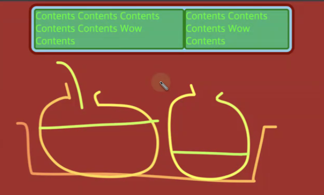
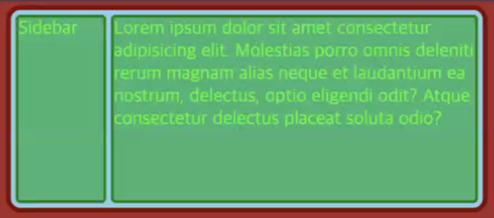
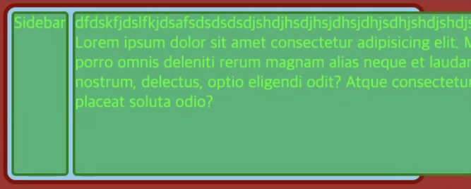
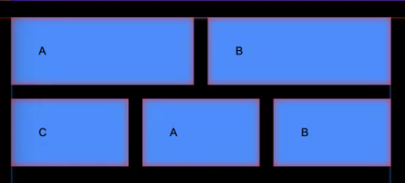
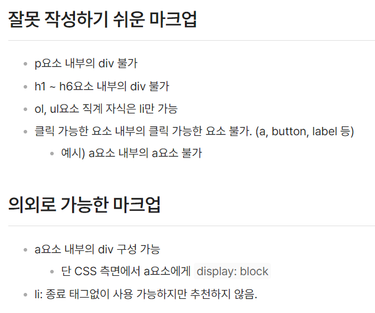

# Flex Box에서의 width

flex box에서의 `width`는 단축속성의 개념이다.

```css
.flex-item {
  width: 200px;
  /* 다음과 같이 속성이 바뀐다.
  flex-basis: auto -> 200px; 
  min-width: auto -> 200px;
  */
}
```

만약 flex container에 충분히 가용공간이 있고, 새로운 flex item을 추가하려 할 때,

나머지 item들의 `width`가 줄어든다.


`flex-basis`와 마찬가지로 `min-width`도 width가 줄어듦에 따라 같이 **재계산**되어 줄어들기 때문이다.

> `flex-basis`와 `width` 속성이 모두 있을 때 flex item은 `flex-basis`가 적용된다.

# 과제 리뷰

## 1. 안전성 높은 플렉스 박스 레이아웃 설계

### 사이드바 너비 고정

기본적으로 `flex-basis: auto`에 의해서 컨텐츠의 양이 많은 아이템의 너비가 더 큰 비중을 차지하게 된다. (수조 안에 물이 든 봉지 두개를 생각하면 된다.)



따라서 컨텐츠부터 넣고 시작했다면 컨텐츠 길이에 따라 변하는 불완전한 레이아웃이 된다.

> 레이아웃부터 잡아야 한다.



왼쪽 아이템이 `width: 180px`인 사이드바라고 할 때, 오른쪽 아이템의 컨텐츠 길이에 의해 영향을 받지 않게 하는 방법

사이드바의 너비가 오른쪽 아이템에 의해 영향을 받지 않게 하거나

- flex-shrink: 0;

  또는

- min-width: 180px;

또는 오른쪽 아이템이 내부 컨텐츠에 의해 너비가 결정되지 않게 하면 된다.

- flex-basis: 0;

### 아이템 너비 고정



min-width가 초깃값 auto이기 때문에 내부 컨텐츠의 길이(가장 긴 단어의 길이)에 의해 아이템 너비가 결정된다.

> flex-grow: 1 => 가용 공간 가득 채우라. 이제 flex-basis를 곁들인...

> flex-basis: 0 => 내부 콘텐츠 크기 + grow 가 아닌, grow로만 너비가 결정될 수 있도록 함.

> min-width: 0 => 내부 콘텐츠가 부모의 너비에 영향을 끼치지 않게끔 처리함.

flex-basis는 flex container 안쪽

min-width는 바깥쪽 침범을 막는다

견문색 패기, 어처구니 min-width...

## 2. 사이드바 마크업

### navigation bar

- #### gnb (global navigation bar)

  : 전체 페이지에서 사용하는 네비게이션 바

- #### lnb (local navigation bar)

  : 특정 페이지에서 사용하는 네비게이션 바  
   : aside 태그를 사용할 수 있다.

### ul, li 요소

- 연관있는 요소는 ul, li를 적극 활용한다.

- ul 내부에는 li 요소만 올 수 있다.

```html
<aside>
  <h2>Genre</h2>
  <ul>
    <li>
      <h3>Action & Adventure</h3>
      <ul>
        <li href=""><a>Adventures</a></li>
        <li href=""><a>Action Thrillers</a></li>
        <li href=""><a>Superhero Movies</a></li>
      </ul>
    </li>
    <li>
      <h3>Dramas</h3>
      <ul>
        <li><a href="">Crime Dramas</a></li>
        <li><a href="">Teen Dramas</a></li>
        <li><a href="">Romantic Dramas</a></li>
      </ul>
    </li>
  </ul>
</aside>
```

## 3. CSS

```css
 <aside class="category">
              <h2>Genre</h2>
              <ul class="category-list">
                <li class="category-item">
                  <h3>Action & Adeventure</h3>
                  <ul class="category-sub">
                    <li><a href="">Adventures</a></li>
                    <li><a href="">Action Thrillers</a></li>
                    <li><a href="">Superhero Movies</a></li>
                  </ul>
                </li>
                <li class="category-item">
                  <h3>Dramas</h3>
                  <ul class="category-sub">
                    <li><a href="">Crime Dramas</a></li>
                    <li><a href="">Teen Dramas</a></li>
                    <li><a href="">Romantic Dramas</a></li>
                  </ul>
                </li>
              </ul>
            </aside>
```

`category`밑의 `li`를 선택하기 위해 `.category > li` 선택자를 사용할 수 있다.

하지만 셀렉터가 너무 길어지면 특정성 점수를 의식해야 하므로 `category-item`으로 분리한다.

### 4. 아이콘 디자인

디자인 목적으로 쓰인 아이콘은 가상요소에 `background-image`를 사용해 스타일링한다.

#### 이미지 스프라이트 기법

한장의 이미지 파일에 여러 아이콘을 두어 한번에 다운로드 함으로써 웹 성능을 최적화한다.

`background-position`으로 위치를 조절하며 아이콘을 바꿀 수 있다.

> 호버 효과를 주었을 때 새로운 이미지를 로드할 필요 없이 background-position-y만 움직여 빠른 효과를 준다.


## 2. 메인

### 마크업

```html
<ul class="l_row">
  <li class="l_col">
    <secition class="card"></section>
  </li>
</ul>
```

### 플렉스 박스

플렉스 아이템을 한 row에 세 개씩 고정하는 방법

```css
.l_row {
    display: flex;
    row-gap: 20px;
    flex-wrap: wrap;
    margin: 0 -10px;

    /* 이거 못씀
    column-gap: 20px
    */
}

.l_col {
  width: calc(100% / 3);
  padding; 0 10px;
  box-sizing: border-box;
}
```

### 그리드 시스템

아이템을 클래스 선택자로 선택하여 width: calc (100% / 2)등을 주어 특정 row의 단 개수를 늘일 수 있다.



### 12 컬럼 그리드

가로 12칸 중 몇칸을 차지할 지 width로 정의된 클래스를 추가하여 원하는 대로 그리드를 만들 수 있다.

```css
.l_col_12_12 {
  width: 100%;
}
.l_col_11_12 {
  width: 91.66666667%;
}
.l_col_10_12 {
  width: 83.33333333%;
}
.l_col_9_12 {
  width: 75%;
}
.l_col_8_12 {
  width: 66.66666667%;
}
.l_col_7_12 {
  width: 58.33333333%;
}
.l_col_6_12 {
  width: 50%;
}
.l_col_5_12 {
  width: 41.66666667%;
}
.l_col_4_12 {
  width: 33.33333333%;
}
.l_col_3_12 {
  width: 25%;
}
.l_col_2_12 {
  width: 16.66666667%;
}
.l_col_1_12 {
  width: 8.33333333%;
}
```

#### 미디어 쿼리

위 클래스 라이브러리를 복사하여 미디어 쿼리 안에서 이름을 변경하여 저장해놓는다. (`.l_col_tablet_6_12` 등)

그리고 너비 변경이 필요한 요소에 클래스 이름을 추가해 놓는다.

## 버튼

inline 요소인 버튼을 이용한다.

컨텐츠가 주로 한 줄이기 때문에 고정 `height`와 정렬을 위해 `line-height`를 사용한다.

`letter-spacing`과 `text-indent`에 같은 값을 주어 자간을 늘이고 가운데 정렬을 한다.

## 문제 제기

카드 컨텐츠의 글 길이가 많아지면 각 카드의 높이가 들쭉날쭉 된다.

> flex-direction으로 해결할 계획

## 참고


