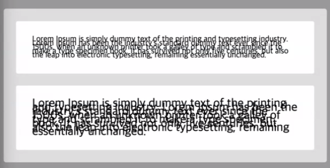

# 과제 리뷰

## 1. 긴 글 한줄로 나타내기

`height`, `line-height`를 지정해 세로 정렬된 글 박스를 네거티브 마진를 이용해 옮길 때

```css
.card-header h2 {
  /* ... */
  width: fit-content;
  white-space: nowrap;
}
```


width: fit-content를 제거하고 뒤의 오버플로우에 말줄임표를 적용해 보자.

```css
.card-header h2 {
  /* ... */
  max-width: fit-content;
  width: auto;

  white-space: nowrap;
  overflow: hidden;
  text-overflow: ellipsis;
}
```


텍스트 길이가 짧은 경우에도 `width:auto`의 영향을 받지 않도록 `max-width:fit-content` 처리를 해주었다.

> text-overflow는 한 줄에만 적용된다.

## 2. 표시되는 줄 개수 정하기

### line-height를 이용한 방법

```css
.card-contents {
  /* ... */
  line-height: 1.4;
  height: calc(1.4em * 6); /* 6줄로 표시된다. */
}
```

### vendor prefix를 이용한 방법

```css
.card-contents {
  /* ... */
  display: -webkit-box;
  -webkit-box-orient: vertical;
  -webkit-line-clamp: 6;
}
```

위 경우에는 말줄임표도 적용된다.

### em과 line-height

현재 폰트사이즈와 동기화되어 값이 계산된다.


왼쪽 가상 요소의 너비와 높이를 `em`으로 지정하면 글자 크기에 따라 줄어든다.

부모에 `line-height` 값을 `1`을 주면 하위 요소의 `line-height`는 각자의 `font-size`로 적용된다.

하지만 부모의 `line-height`에 `1em`을 주면 값이 계산이 된 후 상속되기 때문에 아래와 같이 모든 하위 요소에 부모의 `font-size`가 적용된다.



## 3. 태그

해시태그 `#`은 태그 내용을 나타내는 `a` 요소의 가상요소 `a::after`로 만들 수 있다.

가로배치에 대하여 항상 flex box를 사용하는 것은 경계해야한다.

> 폰트가 요물이다.

폰트에 따라 적용해야 할 세부 간격이 모두 다르므로 초기에 폰트를 정한 뒤 스타일링을 시작하는 순서가 적절하다.

## 4. 레이아웃 시프트

로딩 속도 등의 이유로 예기치 못한 레이아웃 위치의 변동이 발생하는 문제


https://web.dev/static/articles/cls/video/web-dev-assets/layout-instability-api/layout-instability2.webm?hl=ko

이미지 요소의 부모 요소에 `aspect-ratio: 600 / 400`의 속성을 주어 이미지를 불러오기 전 미리 공간을 차지하도록 한다.

## 5. 텍스트 줄 바꿈 제어

한글의 줄 바꿈 규칙을 영어와 같이 단어를 기준으로 바꾸는 방법

```css
/* Typography */
:root {
  font-family: var(--font-en);
  word-break: keep-all;
  overflow-wrap: break-word;
  /* word-wrap */
}
```
