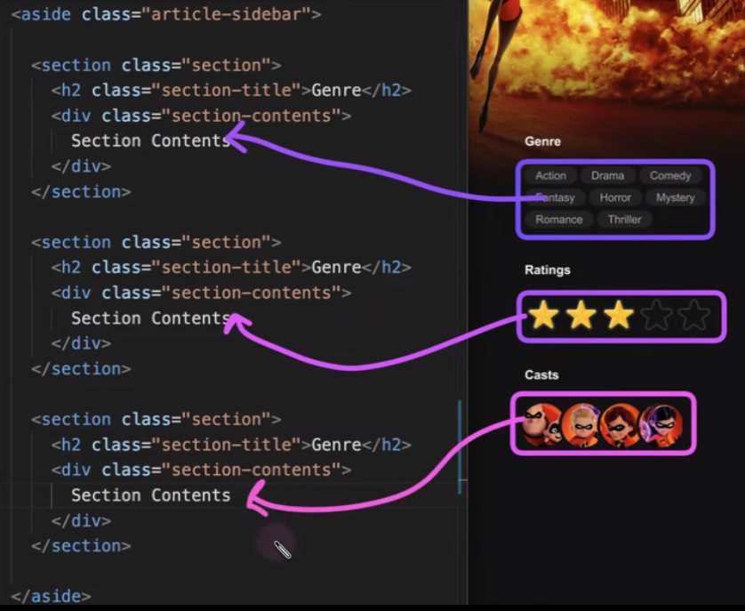
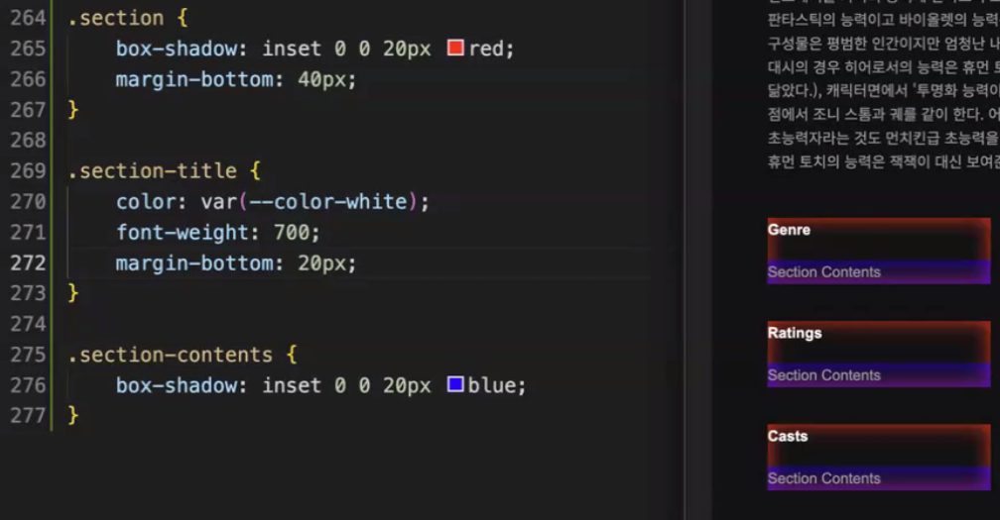
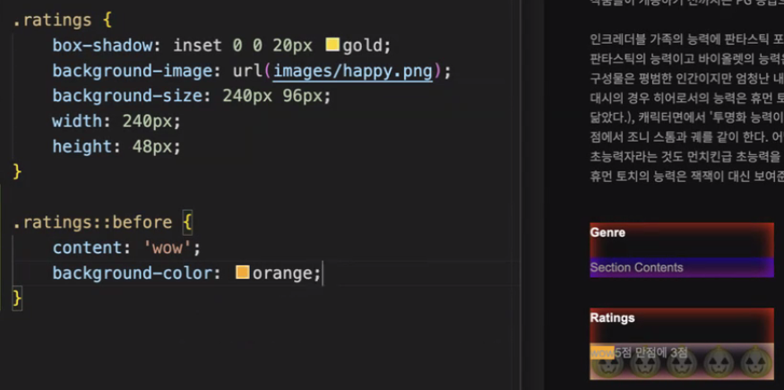
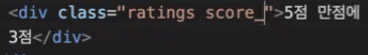
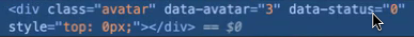
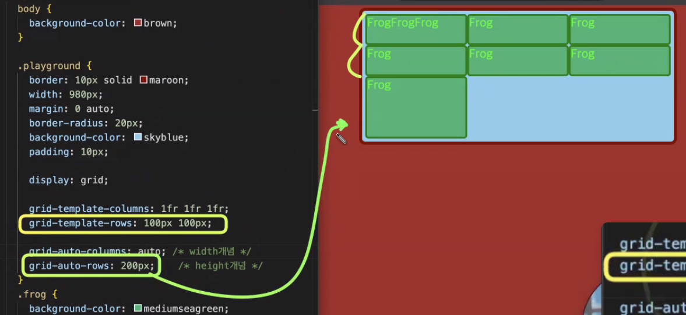
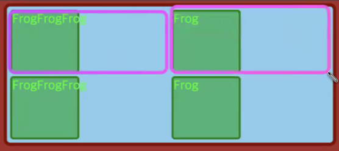
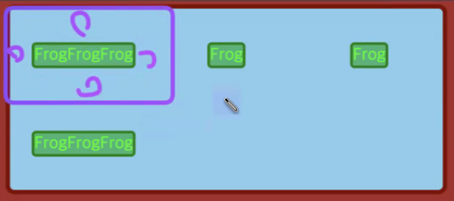

# 복습

## 1. em의 유무

`line-height` 등의 속성 값의 단위에 em과 배수(숫자)를 줄 수 있다.

요소가 자식 요소를 가지고 있다고 했을 때,

만약 `line-height: 1em`인 경우 요소의 `font-size`로 계산되어 자식에게 그대로 전달된다.

```css
.부모 {
  font-size: 20px;
  line-height: 1em;
}

.자식 {
  /* line-height: 20px; */
  font-size: 10px;
  width: 1em;
  height: 1em;
}
```

`line-height: 1`인 경우 요소의 `font-size`의 1배수라는 뜻으로 전달되기 때문에, 자식은 자신의 `font-size`와 같은 `line-height`를 갖게 된다.

```css
.부모 {
  font-size: 20px;
  line-height: 1;
}

.자식 {
  /* line-height: 1; */
  font-size: 10px;
  width: 1em;
  height: 1em;
}
```

## 2. CSS variable와 rgb 문법의 응용

`rgb`는 `rgba`와 달리 문자열 형태의 색상 값을 받기 떄문에 CSS variable과 함께 사용할 수 있다.

```CSS
:root {
  --black-rgb: 0 0 0;
  --black-10p: rgb( var(--black-rgb) / 0.1 );
  --black-20p: rgb( var(--black-rgb) / 0.2 );
  --black-30p: rgb( var(--black-rgb) / 0.3 );
  --black-40p: rgb( var(--black-rgb) / 0.4 );
}
```

## 3. 웹 폰트

프로젝트에 로컬 폰트를 적용하면 다른 사용자는 해당 폰트를 불러올 수 없다.

따라서 웹사이트에 적용된 폰트를 다운받는 방식의 웹폰트를 사용해야 한다.

### 접근성 높이기

`:root`에 기본 `line-height`(`1.6`)를 고정시켜주는 것이 좋다.

웹사이트가 여러 폰트를 가지고 있다면 폰트에 따라 `line-height`가 달라지기 때문이다.

마찬가지로 `:root`에 `font-size`의 기준값(`62.5%`)을 주고 `body`에 `1.6rem`을 주어 `16px`를 설정한다.

이렇게 하면 사용자가 기준값 조절을 통해 `rem`이 적용되어 있는 요소(핵심 요소)의 폰트 사이즈를 바꿀 수 있다.


## 4. 사이드 바 마크업

공통의 템플릿을 가지고 있다면 클래스를 통일해준다. (클래스 이름은 `section`으로, 하위 요소는 `section-header`, `section-contents` 등으로)

> genre, section-title 같은 클래스 네이밍은 좋지 못하다.





## 5. 레이팅 구현



height를 background-size의 절반만 나오게 하여 빈 별, 가득 찬 별을 보여준다.



컨텐츠는 overflow:hidden으로 숨겨 검색엔진만 볼 수 있도록 한다.

사용자 속성과 속성 셀렉터 방식




## 6. 사용자 프로필

이미지 요소에 `title` 어트리뷰트를 추가시 이미지에 마우스가 긴 시간동안 오버되면 `title` 값을 표시하여 접근성을 향상시킬 수 있다. (`alt`가 SEO에 더 유리하다.)

## 7. 비디오 커버

이미지 커버의 클래스 명을 재사용할 수 있다.

비디오가 소리를 포함할 시 `autoplay="autoplay"` 속성이 작동하지 않기 때문에 `muted="muted"`도 같이 적용한다.

이 속성들은 값과 속성명이 같기 때문에 값의 생략이 가능하다.

```html
<video src="#" autoplay muted loop></video>
```

# 그리드

## 1. 기본 세팅

```css
.container {
  display: grid;

  grid-template-columns: none;
  grid-template-rows: none;

  grid-auto-columns: auto; /* width 개념 */
  grid-auto-rows: auto; /* height 개념 */
}
```

gird 컨테이너 안에 두 아이템을 넣었을 때


grid-template-column 속성에 auto auto 값을 주면 한 줄(column)에 두 아이템이 들어간다.


auto는 flex-grow와 비슷하게 동작한다. (내부 너비에 가용 공간을 등분하여 더해준다.)

또한 컨텐츠 양이 많아지면 나머지 요소의 너비가 자동으로 줄어든다.


grid-template-column의 값

- auto: column 기준에서, 내부 컨텐츠 너비 + stretch(가득 채움)
- 1fr: 그리드 컨테이너 너비 기준에서 내부 컨텐츠 관계없이 비율로 책정

grid-auto-rows는 template-rows이 none과 같이 지정되지 않았을 때 rows의 높이를 결정한다. grid-auto-columns도 마찬가지로 동작한다.

ustify-items와 align-items의 초기값 normal(stretch)에 의해 컨테이너에 꽉 차게된다.

> grid-auto 속성은 grid-template으로 템플릿이 작성되지 않았을 떄 자동으로 지정할 너비, 높이를 나타낸다.



> grid-template로 템플릿을 만드는 것은 컨테이닝 블록을 나눈다는 의미이다.

```css
.container {
  display: grid;
  grid-template-row: 1fr 1fr;
  grid-template-column: 1fr 1fr;
}

.item {
  width: 200px;
}
```



margin: auto

