# grid

## 1. 기본 속성

```css
.container {
  width: 900px;
  height: 400px;
  display: grid;
  justify-items: center; /* 원룸 내의 컨텐츠 위치 */
  justify-content: center; /* 원룸 위치 */
  grid-auto-columns: 200px; /* 원룸 가로 크기 */
}
```

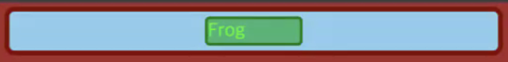

```css
.container {
  width: 900px;
  height: 400px;
  display: grid;

  /* 원룸의 위치 */
  justify-content: normal;
  align-content: center;

  /* frog의 위치 */
  justify-items: normal;
  align-items: normal;

  /* 원룸의 사이즈 */
  grid-auto-columns: auto;
  grid-auto-rows: auto;
}
```

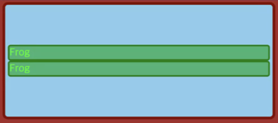

속성들의 초기값 normal, auto는 stretch를 의미한다.
(컨테이닝 블럭 또는 부모 컨테이너를 가득 채움)

```css
.container {
  width: 900px;
  height: 400px;
  display: grid;

  grid-template-columns: auto auto;

  /* 원룸의 위치 */
  justify-content: normal;
  align-content: center;

  /* frog의 위치 */
  justify-items: normal;
  align-items: normal;

  /* 원룸의 사이즈 */
  grid-auto-columns: 100px; /* 무시된다 */
  grid-auto-rows: auto;
}
```

grid-template-columns는 track(식판)을 생성한다.

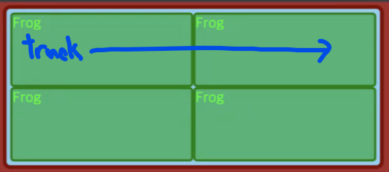

하지만 1fr은 고정된 너비(높이)가 아니라 내부 컨텐츠의 크기에 따라 변할 수 있다.

예를 들어 높이가 긴 아이템이 들어올 때 min-height: 0을 주어 1fr의 높이가 변하지 않게 안정적인 레이아웃을 만들 수 있다.


함수를 이용해 위 내용을 줄여 min-width, min-hegiht의 값을 auto에서 0으로, 너비대신 최대너비를 주어서 유동적인 값을 줄 수 있다.

```css
.container {
  grid-template-columns: repeat(2, minmax(0, 1fr));
  grid-template-rows: repeat(2, minmax(0, 1fr));
}
```

# 레이아웃 1

최외곽 wrapper (min-height가 100vh)를 grid로 만들어 내부 두 컨테이너를 가운데로 정렬한다.

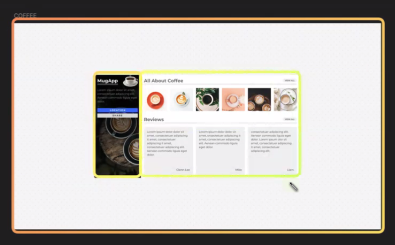

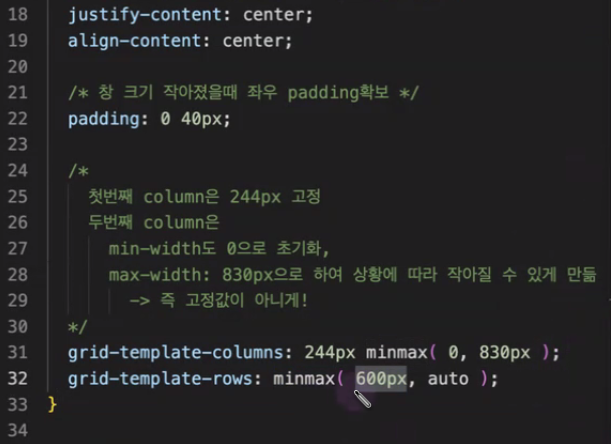

컨테이너의 template 값에 고정 px를 주지 않고 minmax함수를 사용하여 페이지의 너비에 따라 가변되도록 한다. (사이드바는 고정)

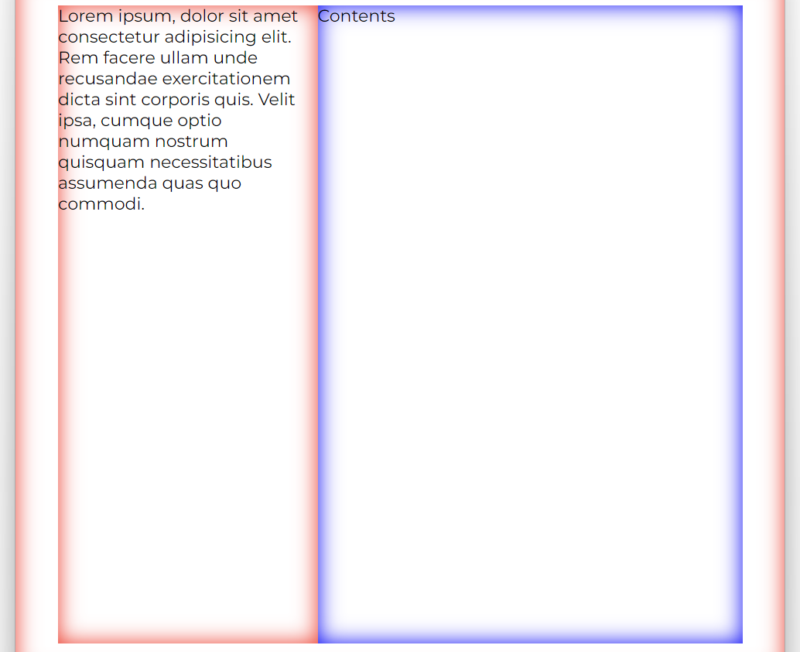

# 레이아웃 2

column의 개수가 웹페이지의 너비에 따라 반응형으로 달라지게 할 수 있다. (1fr를 쓰면 꽉 채우게)

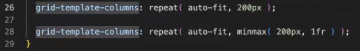

grid-column-start의 값을 행 번호로 주어 셀을 병합할 수 있다.
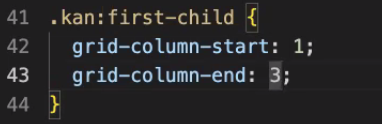

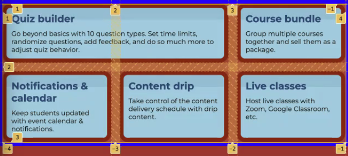

# 레이아웃 3

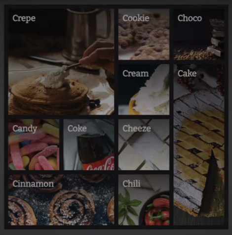

aspect-ratio를 이용해 정사각형 그리드 컨테이너를 만든다.

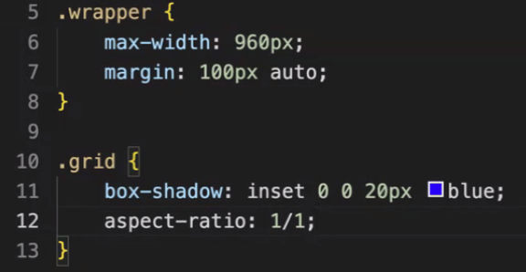

gird-auto-flow를 사용하여 그리드에 아이템이 생성되는 순서를 바꿀 수 있다.


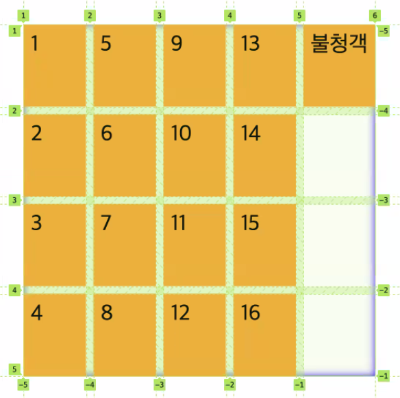

grid-column-start로 그리드 안에 빈 공간을 만들 수 있다. (아이템들은 마크업 순서를 고려해서 채워지기 때문에)

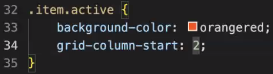


grid-column이나 grid-row 둘 중 하나의 값이 auto인 경우에 빈 공간을 알아서 만든 후 해당 위치로 아이템을 옮긴다.

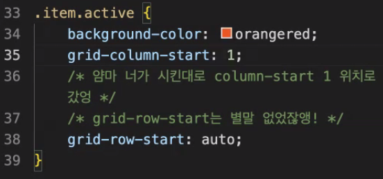

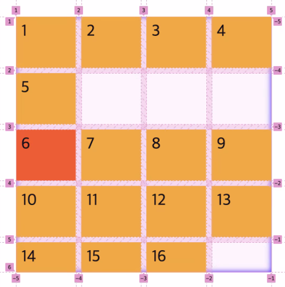

단, griw-row-strt가 명시되었을 때 column-start를 1로 자동으로 바꾼다. (빈 공간이 안 생긴다.)

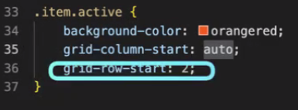

정확한 위치(grid-column-start, grid-row-stat)가 정해지면 마크업 순서를 바꾼다.

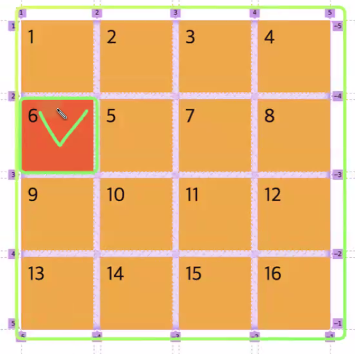

grid-column-start가 column의 개수를 넘어갈 경우 grid-auto-columns의 크기만큼 새로운 column이 추가된다.

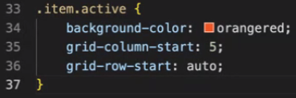

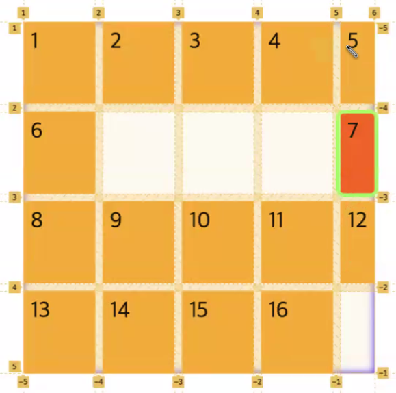

다음과 같이 단축 속성을 사용할 수도 있다.

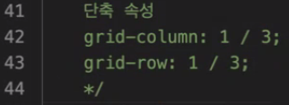
