# Grid

## 1. auto-fit, auto-fill

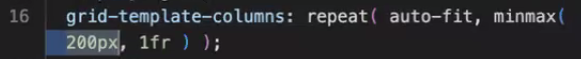

auto-fill은 한 줄에 같은 사이즈(200px)의 아이템이 더 들어갈 수 있으면 그만큼 여백을 만든다.

auto-fit은 여백을 만들지 않고 아이템을 늘여 채운다.


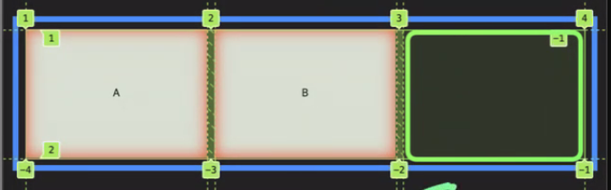

> 여러 row일 때는 track에 의해 auto-fit이 작동하지 않으므로 한 row일때 차이점이 있다.

## grid-row, grid-column

column마다 다른 레이아웃을 적용하기 위해서 grid-row와 grid-column을 활용할 수 있다.

이전 flex box에서 클래스 마다 width를 준 것과 결과가 같다.

하지만 이 방법이 구현이 편리하기 떄문에 더 이상 flex box를 이용한 식판 만들기는 사용하지 않는다.

# wrapper에서 벗어나 패딩까지 차지하는 레이아웃

## 1. 네거티브 마진 이용

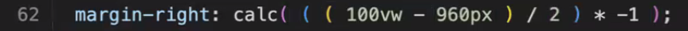


960px은 변할 수 있는 값이므로 100%로 대신하면 된다.

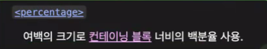

margin-right에서의 100%의 의미는 컨테이닝 블록의 전체 영역이 되고, 이는 section-container에서 다음과 같다.


:root에 변수를 만들어 놓고 필요할 때 margin-left, 또는 margin-right에 적용할 수 있다.

```css
:root {
  --wing: calc(((100vw - 100%) / 2) * -1);
}
```

**정리**

```css
/* 전체 뷰포트 너비 */
--viewport-width: 100vw;

/* margin의 % -> 컨테이닝블록의 너비 기준으로 계산, 즉 100%는 컨테이닝블록의 너비 */
--containing-block-width: 100%;

/* 양쪽 날개 너비 구함 */
--wings-width: calc(var(--viewport-width) - var(--containing-block-width));

/* 한쪽 날개 너비 구함 */
--wing-width: calc(var(--wings-width) / 2);

/* 네거티브마진으로 변환 */
--wing: calc(var(--wing-width) * -1);
```

> 알고 있는 값을 먼저 찾고 이를 활용해 정답을 찾는 방법을 연습해보자.

### vw

vw는 스크롤바를 포함해서 페이지 넓이를 계산한다.

따라서 세로 스크롤바가 생기면 가로 스크롤바도 같이 생긴다.

이 문제는 body에 overflow-x: hidden을 주어 없앨 수 있다.

## 2. 그리드 시스템 이용

template-column을 1fr minmax(0, var(--wrapper-width)) 1fr로 가져와 좌우 그리드 아이템을 페이지 여백으로 사용하는 방법

마크업

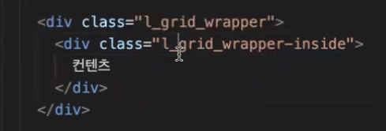

템플릿을 만든 후

gird-column-start로 가운데로 옮긴다.

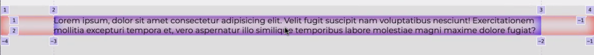

grid-column-end로 오른쪽 패딩을 병합한다.

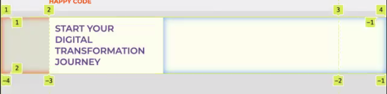

실용성을 높이기 위해 라인에 이름을 붙일 수 있다.

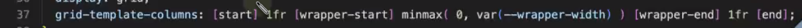

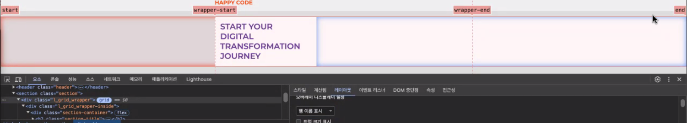

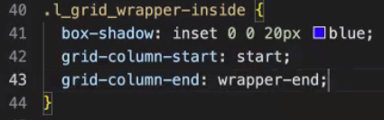

최종 코드

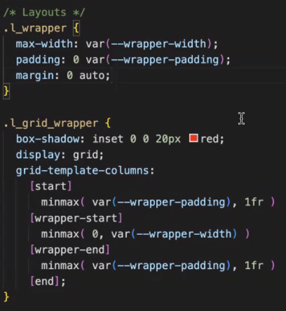

> 변경되는 값은 변수로 사용한다.

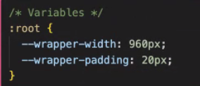

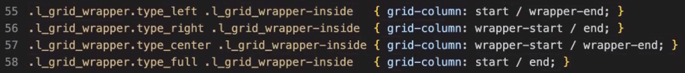

grid-column 값을 조절하는 클래스를 만들어 다양한 레이아웃을 계획할 수 있다.

# 애니메이션

## 1. transform scale

원래 박스의 크기는 놔두고 시각적인 컨텐츠만 확대, 축소한다.

transform-origin으로 transform이 적용되는 기준을 정할 수 있다. (초기값 center)

# incredible 프로필 캡션 달기

## 1. 마크업

## 1. 마크업

```html
<section class="section">
  <h2 class="section-title">Casts</h2>
  <div class="section-contents">
    <div class="casts">
      <figure class="casts-icon">
        
        <figcaption>밥파</figcaption>
      </figure>
      <figure class="casts-icon">
        
        <figcaption>대쉬파</figcaption>
      </figure>
      <figure class="casts-icon">
        
        <figcaption>헬렌파</figcaption>
      </figure>
      <figure class="casts-icon">
        
        <figcaption>바이올렌파</figcaption>
      </figure>
    </div>
  </div>
</section>
```

figure 안에 img와 imgcaption을 넣는다.

imgcaption 에 absolute를 주고 이미지 가운데 오게 배치한다.

```css
.casts-icon figcaption {
  position: absolute;
  background-color: dodgerblue;
  left: 50%;
  transform: translateX(-50%);
  top: 0;
}
```

transform:transform(-50%)와 같이 transform에서 %는 자기 자신 너비를 기준이로 계산되기 때문에 유용하게 사용할 수 있다.


가상요소를 이용해 추가 스타일링을 해준 후 애니메이션을 적용한다.

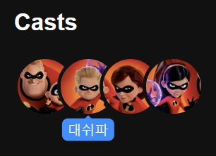

아이템 호버 시 캡션이 내려가고, 마우스가 나갈 시 캡션이 올라오는 동작이 이미지와 같이 캡션에도 적용되므로 애니메이션 오류가 발생한다.

따라서 캡션에 pointer-events: none 속성을 주어 마우스액션을 막는다.
