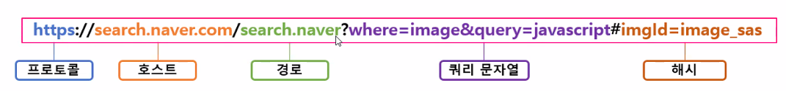

# 프론트 vs 백엔드

## 1. 서버의 역할

- 사용자끼리 데이터를 공유할 수 있게 한다.

- 사용자가 데이터베이스에 있는 데이터에 접근할 때 발생하는 보안 문제를 해결한다.

## 2. 프로토콜

- Client - Server 웹 어플리케이션 구조에서 서로 데이터를 주고받는 네트워킹 규칙

#### HTTP 프로토콜

- HTTP Request

    

  HTTP Request Method는 요청 방식으로 GET, POST, PUT, DELETE, HEAD, PATCH가 있다.

  기본적으로 GET 방식을 사용한다.

- HTTP Response

    
   상태 코드는 프론트의 요청에 대한 처리 상태를 말한다.

## URL

Uniform Resource Location

프론트에서 원하는 리소스를 백엔드에서 식별할 수 있게 구성된 문자열

- 호스트: 흔히 도메인이라 불리는 부분으로 서버의 네트워크 상 주소이다.

- 해시: 프론트에서만 사용하며 현재 애플리케이션의 상태를 나타낸다.
