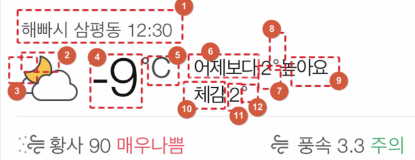

## 1. 정말 장애인이 없나? -> 기술적으로 확인할 수 있는 방법이 없음

## 2. 장애인을 위한 접근성이 있는 서비스가 있는가? -> 접근성을 구축한 후 소비자의 입장에서 선택 가능하도록

접근성 가이드라인

https://www.w3.org/TR/WCAG22/#intro

## 대체텍스트

텍스트가 아닌 모든 요소에 대해 TTS를 이용 가능하도록 텍스트를 함께 제공하는 것

## 장애인이 편리하면 비장애인은 더 편리하다~

-> 카카오 이모티콘 대체텍스트, 비전공자들은 이모티콘 검색 가능

## 초점(focus) 이동

비장애인의 시선이 이동하는 순서를 고려한 초점 이동이 필요하다.

모달 팝업 인식이 순서 맞게 이동되지 않는다. (마크업 순서가 맨 아래에 있기 떄문에)

-> `area-hideen="true"`, `area-hidden="modal"`

## 초점 분리

area-label 처리된 요소만 읽는다.

## 초점 크기

role="button" 또는 area-label 사용

## 둥둥이

둥둥이가 깔려있는 컨텐츠보다 마크업 순서 높게 위치

## 자동재생 금지

TTS 막는다.

## 알림 표시 시간

알림 음성 출력 또는 표시 시간 조절

## 키보드로 동작

줌인, 줌아웃 키보드로 접근할 수 있게

## 영상 자막 필수 제공

## 화면 해설

넷플릭스 👍
