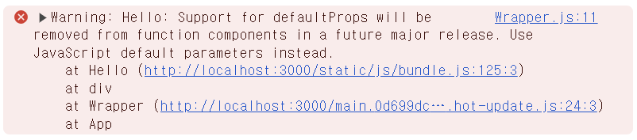

## Props

## defaultProps

컴포넌트에 props 를 지정하지 않았을 때 기본적으로 사용 할 값을 설정한다.

```jsx
import React from "react";

function Hello({ color, name }) {
  return (
    <div style={{ color }}>
      안녕하세요 {name}
      {console.log(color, name)}
    </div>
  );
}

Hello.defaultProps = {
  name: "이름없음",
};

export default Hello;
```

`name`은 `"이름 없음"`, `color`에는 `undefined` 값이 할당된다.

> Javascript의 default parameter를 사용하는 것이 권장된다.



## props.children

wrapper 컴포넌트 내부에 다른 컴포넌트들을 위치시키고 싶을 때 사용된다.

```jsx
function Card({ children, title }) {
  return (
    <div className="card">
      <div className="card-header">
        <h2>{title}</h2>
      </div>
      <div className="card-body">{children}</div>
    </div>
  );
}

// 사용 예시
<Card title="공지사항">
  <p>첫 번째 공지입니다.</p>
  <p>두 번째 공지입니다.</p>
  <button>자세히 보기</button>
</Card>;
```

**props.children의 주요 장점**

1. 재사용성 향상: 컴포넌트를 더 유연하게 사용 가능

2. 컴포넌트 구성: 복잡한 UI를 작은 단위로 분리하여 구성 가능

3. 레이아웃 패턴: 공통 레이아웃을 쉽게 적용 가능

# state

## 여러 개의 input state 관리

input에 `name` attribute를 설정하고, 이벤트가 발생했을 때 이 값을 참조한다

```jsx
import React, { useState } from "react";

function InputSample() {
  const [inputs, setInputs] = useState({
    name: "",
    nickname: "",
  });

  // state 객체의 속성을 가져온 후
  // input의 value에 사용한다.
  const { name, nickname } = inputs;

  const onChange = (e) => {
    const { value, name } = e.target;
    setInputs({
      ...inputs,
      [name]: value,
    });
  };

  const onReset = () => {
    setInputs({
      name: "",
      nickname: "",
    });
  };

  return (
    <div>
      <input name="name" placeholder="이름" onChange={onChange} value={name} />
      <input
        name="nickname"
        placeholder="닉네임"
        onChange={onChange}
        value={nickname}
      />
      <button onClick={onReset}>초기화</button>
      <div>
        <b>값: </b>
        {name} ({nickname})
      </div>
    </div>
  );
}

export default InputSample;
```

## useRef

useRef는 렌더링에 필요하지 않은 값을 참조할 수 있는 React Hook입니다.

useRef는 처음에 제공한 초기값으로 설정된 단일 current 프로퍼티가 있는 ref 객체를 반환합니다.

```jsx
import { useRef } from 'react';

function Stopwatch() {
  const intervalRef = useRef(0);
  // ...
```

다음 렌더링에서 useRef는 동일한 객체를 반환합니다. 정보를 저장하고 나중에 읽을 수 있도록 current 속성을 변경할 수 있습니다.

state가 떠오를 수 있지만, 둘 사이에는 중요한 차이점이 있습니다.

**ref를 변경해도 리렌더링을 촉발하지 않습니다.**

즉 ref는 컴포넌트의 시각적 출력에 영향을 미치지 않는 정보를 저장하는 데 적합합니다.

예를 들어 interval ID를 저장했다가 나중에 불러와야 하는 경우 ref에 넣을 수 있습니다. ref 내부의 값을 업데이트하려면 current 프로퍼티를 수동으로 변경해야 합니다:

```jsx
function handleStartClick() {
  const intervalId = setInterval(() => {
    // ...
  }, 1000);
  intervalRef.current = intervalId;
}
```

```jsx
function handleStopClick() {
  const intervalId = intervalRef.current;
  clearInterval(intervalId);
}
```

ref를 사용하면 다음을 보장합니다:

- (렌더링할 때마다 재설정되는 일반 변수와 달리) 리렌더링 사이에 정보를 저장할 수 있습니다.
- (리렌더링을 촉발하는 state 변수와 달리) 변경해도 리렌더링을 촉발하지 않습니다.
- (정보가 공유되는 외부 변수와 달리) 각각의 컴포넌트에 로컬로 저장됩니다.

예시

```jsx
import { useState, useRef } from "react";

export default function Stopwatch() {
  const [startTime, setStartTime] = useState(null);
  const [now, setNow] = useState(null);
  const intervalRef = useRef(null);

  function handleStart() {
    setStartTime(Date.now());
    setNow(Date.now());

    clearInterval(intervalRef.current);
    intervalRef.current = setInterval(() => {
      setNow(Date.now());
    }, 10);
  }

  function handleStop() {
    clearInterval(intervalRef.current);
  }

  let secondsPassed = 0;
  if (startTime != null && now != null) {
    secondsPassed = (now - startTime) / 1000;
  }

  return (
    <>
      <h1>Time passed: {secondsPassed.toFixed(3)}</h1>
      <button onClick={handleStart}>Start</button>
      <button onClick={handleStop}>Stop</button>
    </>
  );
}
```
