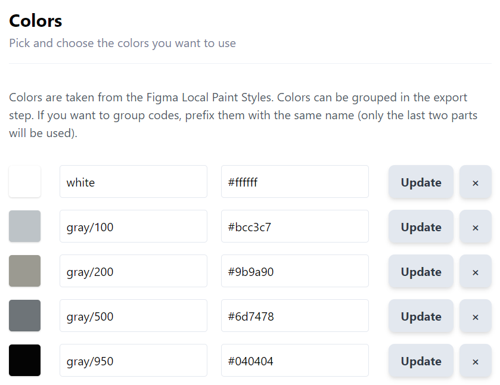

# 피그마

vscode의 fig파일을 피그마에서 import한 후 사용하기

피그마의 Figma Tailwindcs 플로그인을 이용해 피그마 페이지에 적용된 색상이나 그라디언트, 폰트 종류 등을 variable로 변환한 수 있다.



```json
{
  "colors": {
    "white": "#ffffff",
    "gray": {
      "100": "#bcc3c7",
      "200": "#9b9a90",
      "500": "#6d7478",
      "950": "#040404"
    },
    "green": {
      "100": "#03cc5c",
      "200": "#11d975",
      "300": "#22be61"
    }
  }
}
```

위와 같이 theme을 추출하여 tailwind.config.json 파일의 모듈에 extend할 수 있다.

# focus 기능 추가로 접근성 향상

focusible을 가지지 않은 요소에 tap-index="0" 속성을 주어 focus되도록 바꿀 수 있다.
